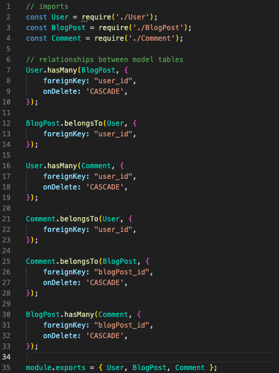
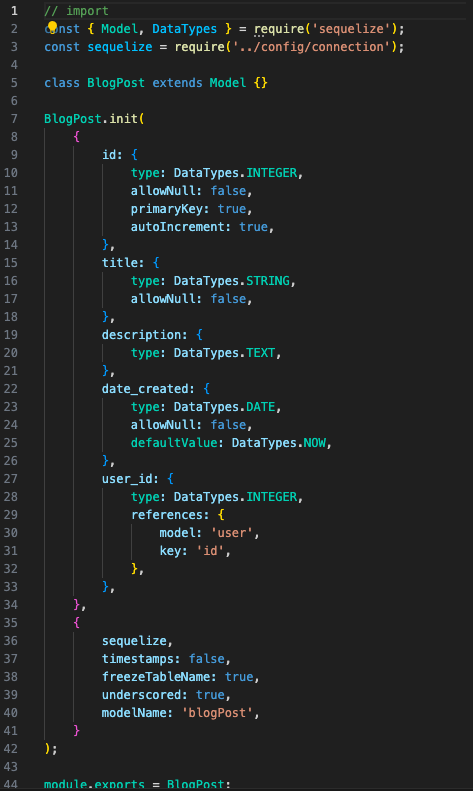
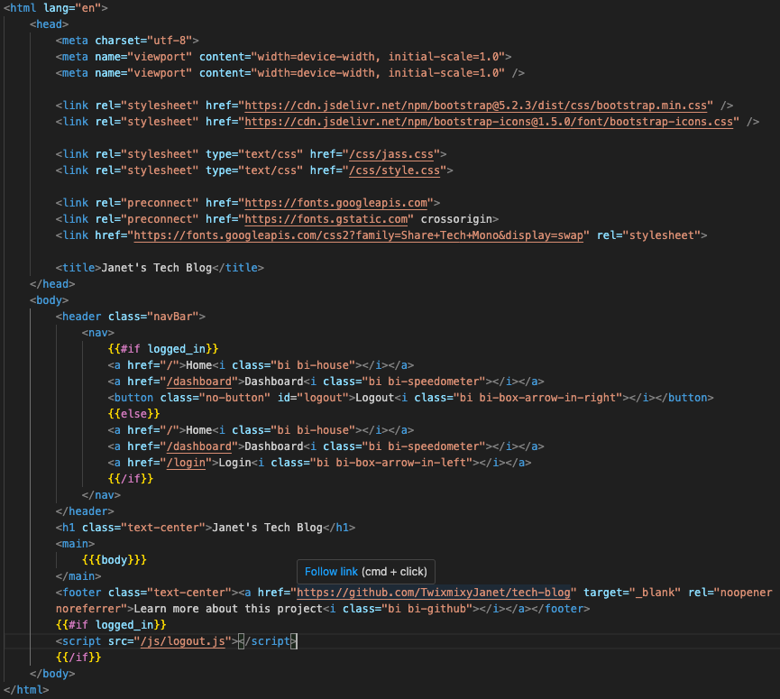
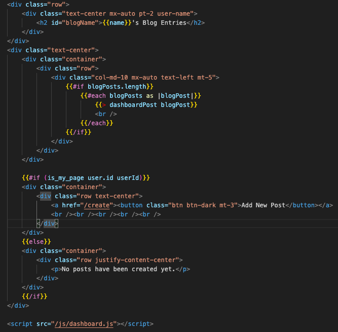
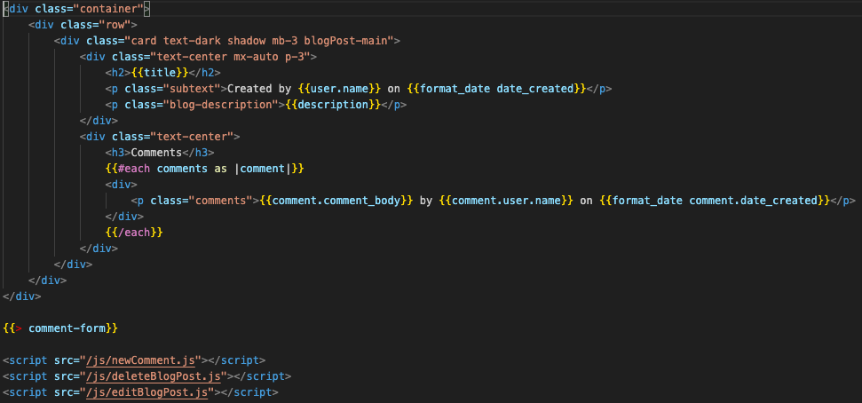
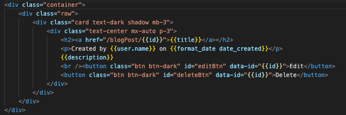

# JANET'S TECH BLOG

### [View Project Video Here](https:// "JANET'S TECH BLOG")<br />
### [View Live Project Here](https:// "JANET'S TECH BLOG")<br />

| Technology Used    | Resource URL |
| --------  | ------- |
| NodeJS      | https://nodejs.org/en |
| ExpressJS      | https://expressjs.com/ |
| Handlebars | https://handlebarsjs.com/ |
| dotenv      | https://www.npmjs.com/package/dotenv |
| bcrypt      | https://www.npmjs.com/package/bcrypt |
| Connect Session  | https://www.npmjs.com/package/connect-session-sequelize  |
| Boostrap      | https://getbootstrap.com/ |
| MySQL      | https://www.mysql.com/ |
| mysql2      | https://www.npmjs.com/package/mysql2 |
| Sequelize  | https://www.npmjs.com/package/sequelize |
| Nodemon  | https://www.npmjs.com/package/nodemon |
| Insomnia | https://insomnia.rest/ |
| Sequel Ace | https://sequel-ace.com/ |
| Screencastify | https://www.screencastify.com/ |
| JavaScript | https://developer.mozilla.org/en-US/docs/Web/JavaScript |
| Git       | https://git-scm.com/ |
| GitHub     | https://github.com/ |
| VSCode    | https://code.visualstudio.com/ |

## Table of Contents

* [Description](#description)
* [Installation](#installation)
* [Usage](#usage)
* [Credits](#credits)
* [License](#license)

## Description:
This project is a full stack tech blog. It is a content management style website. This site allows the user to create, manage, and delete blog posts.<br />
<br />

### How to use this app:

* Click on the deployed link above 'View Live Project Here'
* To interact with this site, it requires a login
  * Navigate to the "LOGIN"
  * Enter credentials
  * After logging in, navigate to either an existing post, the dashboard or to logout.
  * Existing posts on the homepage can be clicked on
    * Read the post and add a comment with your thoughts
  * Dashboard
    * Add new post
    * Edit existing post
    * Delete existing post
  * Logout
* Interact with the page as needed

  ## User Story

```md
AS A developer who writes about tech
I WANT a CMS-style blog site
SO THAT I can publish articles, blog posts, and my thoughts and opinions
```

## Acceptance Criteria

```md
GIVEN a CMS-style blog site
WHEN I visit the site for the first time
THEN I am presented with the homepage, which includes existing blog posts if any have been posted; navigation links for the homepage and the dashboard; and the option to log in
WHEN I click on the homepage option
THEN I am taken to the homepage
WHEN I click on any other links in the navigation
THEN I am prompted to either sign up or sign in
WHEN I choose to sign up
THEN I am prompted to create a username and password
WHEN I click on the sign-up button
THEN my user credentials are saved and I am logged into the site
WHEN I revisit the site at a later time and choose to sign in
THEN I am prompted to enter my username and password
WHEN I am signed in to the site
THEN I see navigation links for the homepage, the dashboard, and the option to log out
WHEN I click on the homepage option in the navigation
THEN I am taken to the homepage and presented with existing blog posts that include the post title and the date created
WHEN I click on an existing blog post
THEN I am presented with the post title, contents, post creator’s username, and date created for that post and have the option to leave a comment
WHEN I enter a comment and click on the submit button while signed in
THEN the comment is saved and the post is updated to display the comment, the comment creator’s username, and the date created
WHEN I click on the dashboard option in the navigation
THEN I am taken to the dashboard and presented with any blog posts I have already created and the option to add a new blog post
WHEN I click on the button to add a new blog post
THEN I am prompted to enter both a title and contents for my blog post
WHEN I click on the button to create a new blog post
THEN the title and contents of my post are saved and I am taken back to an updated dashboard with my new blog post
WHEN I click on one of my existing posts in the dashboard
THEN I am able to delete or update my post and taken back to an updated dashboard
WHEN I click on the logout option in the navigation
THEN I am signed out of the site
WHEN I am idle on the site for more than a set time
THEN I am able to view posts and comments but I am prompted to log in again before I can add, update, or delete posts
```

### Lessons Learned

#### 1. MVC: MODELS
Thank GOODNESS for sequelize! Not that I don't like SQL, but using sequelize to model things out is beyond beneficial and so much easier to use and test. As you will see there is plenty of error-catching throughout my code to find potential issues. Highly recommend!
When it comes to models I learned how to connect tables together through what we deemed as the index file. Then from there we broke out a model file for each table of data, for example the BlogPost.
<br />



#### 2. MVC: VIEWS
Let's go Handlebars!! This part, although very confusing to get the hang of, I find to be super exciting. Modulating pages is a great way to scale projects quickly. With handlebars we are able to modulate our HTML so that it is easy to reuse throughout the application. For example we start with the main page for the layout, then we have several additional pages to handle different aspects of the application. We can also use partials to manage parts of an existing page. Examples shown are the main, dashboard, blogpost, and dashboardpost.
<br />





#### 3. MVC: CONTROLLERS(ROUTES)
The routes was by far the hardest part of this project for me. I'm still not sure I got it right, but the application is working. Controllers manage the navigate and data flow through out the application, which is why this is a full stack project.
<br />


#### 4. Sequelize -> Models
Using Sequelize allows us to do SQL type actions through methods. Instead of us writing long and potentially confusing SELECT statements, we can use this package manager.
<br />


#### Synopsis
We were given a lot of starter code for this project, so the main aspects we had to complete we listed above in the lessons learned.

## Installation

1. Create a new repository on GitHub, to store this project.
2. Clone the repository to your computer.
3. Copy files to your own repository.
4. Follow the steps for "How to" above
5. Make changes to the code.
6. Commit the changes to the local repo.
7. Push the changes to the remote repo.

## Usage

This is a full stack tech blog project. If you would like to update and use app follow the installation steps and curate it to your needs. If you would like to use this app, follow the steps under the description 'How to' above and click the link at the top of this page.

## License

MIT License
Copyright (c) 2023 Twixmixy / Janet Webster

<hr />

## About The Author
### Janet Webster
Full Stack MERN Software Engineer in training.

- [GitHub](https://github.com/TwixmixyJanet/)
- [LinkedIn](https://www.linkedin.com/in/twixmixy/)
- [Twitter](https://twitter.com/Twixmixy)
- [WakaTime](https://wakatime.com/@Twixmixy)


<br /><br /><br /><br /><br /><br /><br /><br /><br /><br /><br /><br /><br /><br /><br /><br /><br /><br /><br /><br /><br /><br /><br /><br /><br /><br /><br /><br /><br /><br /><br /><br /><br /><br /><br /><br /><br /><br /><br /><br /><br /><br /><br /><br /><br /><br /><br /><br /><br /><br /><br /><br /><br /><br /><br /><br /><br /><br /><br /><br /><br /><br />

Did you really read down this far? Gold star for you! ⭐
```
You have received 5+ points in being EXTRA
```